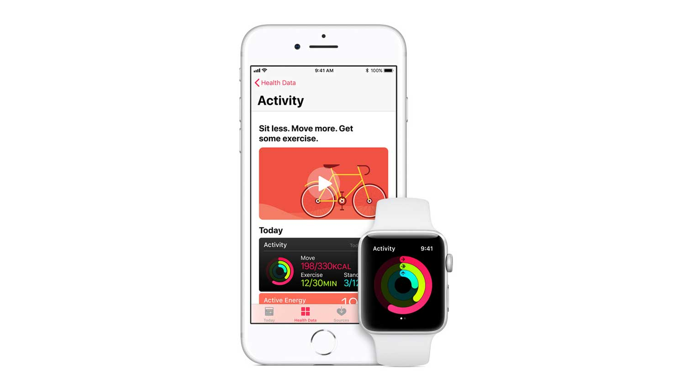

# Heart Rate Dynamic Models by Apple

## Overview and Origin
* [Apple Watch](https://en.wikipedia.org/wiki/Apple_Watch) is a product of [Apple Inc](https://en.wikipedia.org/wiki/Apple_Inc) which was founded on April 1, 1976 by Steve Jobs, Steve Wozniak, and Ronald Wayne as a partnership and was incorporated by Wozniak and Steve Jobs in 1977. The company's first product is the Apple I, a computer designed and hand-built entirely by Wozniak. To finance its creation, Jobs sold his Volkswagen Bus, and Wozniak sold his HP-65 calculator. Multimillionaire Mike Markkula provided essential business expertise and funding of $250,000 to Jobs and Wozniak during the incorporation of Apple.

* Apple was founded as Apple Computer Company  to produce and market Steve Wozniak's Apple I personal computer.  Its second computer, the Apple II, became a best seller as one of the first mass-produced microcomputers. Apple introduced the Lisa in 1983 and the Macintosh in 1984, as some of the first computers to use a graphical user interface and a mouse.

    

## Business Activities

* Scientists and fitness enthusiasts have been tinkering with models to understand how our bodies respond during exercise. These models are like little digital trainers—they predict things like heart rate (HR) based on what you’re doing.

* Now, imagine you’re wearing one of those fancy fitness wearables (you know, the ones that track your steps, heart rate, and probably even your mood). These wearables face a challenge: the real world is noisy! There’s hustle, bustle, and all sorts of distractions out there. So, applying those neat exercise physiology models to these wearables isn’t as straightforward as it sounds.

 

* The intended customers can be a fitness fanatic or  a heart health enthusiast. The global heart rate monitoring devices market is expected to grow from $12.4 billion in 2021 to a whopping $20.6 billion by 2032. That’s a 4.7% annual growth rate! 

* Researchers from Apple Inc have come up with a hybrid solution. It’s like mixing your favorite smoothie—except instead of berries and spinach, they’re blending a physiological model (think lab-tested science) with some snazzy neural networks (fancy AI stuff). The result? A personalized fitness representation just for you! 

* The optical heart sensor combined with heart rate dynamic AI models in Apple Watch uses what is known as photoplethysmography. This technology, while difficult to pronounce, is based on a very simple fact: Blood is red because it reflects red light and absorbs green light. Apple Watch uses green LED lights paired with light‑sensitive photodiodes to detect the amount of blood flowing through your wrist at any given moment. When your heart beats, the blood flow in your wrist — and the green light absorption — is greater. Between beats, it’s less. By flashing its LED lights hundreds of times per second, Apple Watch can calculate the number of times the heart beats each minute — your heart rate. The optical heart sensor supports a range of 30–210 beats per minute. In addition, the optical heart sensor is designed to compensate for low signal levels by increasing both LED brightness and sampling rate.

* They’re using large language model (LLM)-powered knowledge graphs, scientific pipelines with custom models, improved decision-making strategies, and even training their own protein language models (PLMs) before seamlessly deploying through microservices.

* The optical heart sensor can also use infrared light. This mode is what Apple Watch uses when it measures your heart rate in the background, and for heart rate notifications. Apple Watch uses green LED lights to measure your heart rate during workouts and Breathe sessions, and to calculate walking average and Heart Rate Variability (HRV).

* Apple Watch Series 4 and later and all models of Apple Watch Ultra also have built-in electrodes in the Digital Crown and the back of Apple Watch, which can measure the electrical signals across your heart when used with the Heart Rate app or the ECG app. When you place your finger on the Digital Crown, it creates a closed circuit between your heart and both arms, capturing the electrical impulses across your chest. 

## Landscape

* Apple Inc — the tech giant that’s been shaping our digital lives since the days of chunky Macintosh computers and neon-colored iMacs. Below are the diverse fields the company orchestrates :

    * Personal Computers (Macintoshes):
Remember those sleek silver laptops and desktops? Yep, those are Apple’s Macintosh computers. They’ve been our creative companions, our workhorses, and our canvas for digital art. Whether you’re editing videos, writing code, or just binge-watching cat videos, Macs have your back.
    * Mobile Devices (iPod, iPhone, and iPad):
Ah, the iconic trio! Let’s break it down:
iPod: The pocket-sized jukebox that revolutionized how we listen to music. It’s like having a mini concert in your pocket.
iPhone: The game-changer. The device that made us all thumb acrobats—swiping, tapping, and FaceTiming our way through life. It’s not just a phone; it’s a portal to the digital universe.
iPad: The tablet that bridges the gap between laptops and smartphones. Whether you’re sketching, reading, or binge-watching Netflix, the iPad is your canvas.
    * Software (macOS, iOS, watchOS, and tvOS):
Apple isn’t just about hardware; it’s a software symphony too:
macOS: The operating system that powers Macs. It’s like the backstage crew—making sure everything runs smoothly.
iOS: The heartbeat of iPhones and iPads. It’s where apps come alive, notifications buzz, and emojis party.
watchOS: The magic behind the Apple Watch. It tracks heartbeats, counts steps, and nudges you to stand up (because sitting is so last century).
tvOS: The conductor for Apple TV. It brings movies, shows, and streaming services to your living room. Pass the popcorn!
    * Health and Fitness (Apple Watch and HealthKit):
The Apple Watch isn’t just a stylish accessory; it’s a health detective. It monitors heart rates, tracks workouts, and even detects falls. Plus, HealthKit—a platform that lets health apps share data seamlessly. It’s like having a personal trainer and a doctor in one tiny device.
    * Music and Content (iTunes, Apple Music, and Apple TV+):
iTunes: The jukebox that evolved into Apple Music. It’s where you groove to tunes, discover artists, and create playlists.
Apple Music: Your musical soulmate. It streams millions of songs, hosts exclusive concerts, and even suggests tunes based on your mood.
Apple TV+: Original shows, movies, and documentaries. It’s like having a VIP pass to Hollywood.
Innovation and Design (Think Different):
Apple isn’t just about gadgets; it’s a philosophy. Think minimalistic design, attention to detail, and that iconic half-bitten apple logo. It’s about making technology feel human.

* Since the release of the Health app in 2014 and the Apple Watch in 2015, Apple has been on a mission to empower users with meaningful health insights. Here are the key pillars of their health and fitness features over the last 10 years 
    * Heart Sensor
    * High Heart Rate Notification
    * Estimate of VO2 max
    * ECG - Irregular rythm notification
    * Cardio Fitness
    * Heart Rate Dynamic Models

* Below are few other major companies that cater to health and wellness of Heart 
    * Fitbit Sense
    * Garmin Venu 2 Plus
    * Samsung Galaxy Watch 6 Classic
    * Amazfit GTR 4

## Results

* Below are few of the business impacts of Apple watch related to Heart health
    * The Heartbeat Detective:
        * Picture this: Your Apple Watch is like a tiny detective with a heart-shaped magnifying glass. It peeks at your ticker, beat by beat, and whispers secrets to you.
        * Features like high and low heart notifications, Cardio Fitness, irregular rhythm alerts, and the ECG app turn your wrist into a health dashboard. It’s like having a mini ER on standby.
    * The Investigator Support Program:
        * Apple didn’t stop at making cool gadgets; they also handed out Apple Watches like candy to researchers. 
        * Through the Investigator Support Program, scientists get their hands on these wrist wizards. And what do they do? They break new ground in health research, especially when it comes to understanding the heart. 

    * Prolonged QT and Heartbreak:
        * Dr. Conyers says, “Hey, we used to think of cardiac toxicity as something that happened 10 years later.” But now? Apple Watch is like their early warning system.
        * Toxicities from cancer treatment can mess with heart rhythm—especially prolonged QT syndrome. Imagine your heart doing the cha-cha when it should be waltzing. 

    * The Heart Study Symphony:
        * Apple’s heart study isn’t just a solo act; it’s a global symphony. Researchers everywhere are tuning in.
         The ECG app on Apple Watch Series 4 and later can record heartbeats and rhythms using that fancy electrical heart sensor. It’s like a tiny orchestra conductor waving its baton. 

            

So, the business impact is that Apple’s not just selling watches; they’re selling heart health insights. They’re turning wearables into lifesavers, one heartbeat at a time.

* Some of the core metrics that companies in this field use to measure success are below
    * Heart Rate Variability (HRV):
        * Imagine your heart doing a little dance—sometimes it’s a tango, other times a waltz. HRV measures these subtle variations in the time interval between consecutive heartbeats.
        * High HRV indicates good cardiovascular health and adaptability.
        * Low HRV indicates your heart needs help
        * Wearables track HRV over time, giving you insights into stress levels, recovery, and overall heart resilience. 
    * Deep Sleep:
        * Deep sleep is where your body repairs, rejuvenates, and upgrades. It’s like defragging your brain and heart.
        * Wearables with sleep tracking capabilities monitor your sleep stages. During deep sleep, your heart enters maintenance mode, ensuring optimal rest and rejuvenation.
    * REM Sleep:
        * Rapid Eye Movement (REM) sleep is a stage of sleep characterized by vivid dreams, increased brain activity, and memory consolidation.
        * During REM sleep, your heart remains active and synchronized with the dream beats. Wearables can track REM sleep cycles, providing insights into your heart's activity during this stage of sleep.
        * If your REM metrics are abnormal, it may indicate a disruption in your heart's participation in the nocturnal dance floor of dreams.

* The Company's performance is very poor compared with its competitors. It won't give you in-depth analysis of how long it took you to fall asleep, nor does it distill your overall rest into a single sleep score just like Fitbit or Garmin.

## Recommendations

* If I were to advise the company, I would recommend including sleep analysis, a blood pressure monitoring system, and stress level tracking. These additional features would enhance the Apple Watch's capabilities and provide users with valuable health insights. Sleep analysis would allow users to track their sleep patterns and optimize their rest, while a blood pressure monitoring system would provide important cardiovascular information. Stress level tracking would help users manage their stress levels and promote overall well-being. By incorporating these features, Apple can further solidify its position as a leader in the health and fitness wearable market.
* By offering these services, Apple will gain a competitive edge and stand out among its competitors such as Whoop, Oura Ring, and Fitbit. None of these competitors currently offer the features mentioned. As a pioneer in the industry, Apple's inclusion of these features makes the Apple Watch a highly desirable product compared to others in the market.

* Technologies below should be used inorder to implement the mentioned suggestions.
    *  heart rate and movement to estimate sleep stages and cycles. The built-in accelerometer should effectively detects movements, providing a fairly accurate representation of when you fall asleep and wake up. The autonomic nervous system (ANS) controls the heart rythm.
    * Calculate the blood oxygen and heart rate during sleep, and use the metrics to determine the Oxygenated hemoglobin (OHb) and deoxygenated hemoglobin (RHb) 
    * Calculate Photoplethysmography (PPG) that tracks the time-varying absorption of light in your tissue which helps in understanding the Blood Oxygen absorptionlevels
    * Electroencephalography (EEG) which measures brainwaves.
    * Touch sensor to calculate the blood oxygen and blood pressure.

* These Technologies are appropriate to implement sleep analysis, Blood Pressure Monitoring System and Stress level calculator for the below reasons.
    * They help with detecting light sleep, deep sleep, REM sleep and awakeness
    * They catch your nocturnal acrobatics
    * EEG calculates alpha asymmetry which correlates with stress levels. 
    * HRV tracks changes in the time between heartbeats and ANS controls the rythm
    * Touch sensor with gen AI models to calculate the Blood Oxygen levels and pressure levels.
    * HRV reflects stress. By analyzing the variations in heartbeat intervals, we get insights into overall health, including blood pressure regulation.
    

    ## Addendum

    * https://en.wikipedia.org/wiki/Apple_Inc.
    * https://support.apple.com/en-us/120277
    * https://openreview.net/pdf?id=HFpVlD0vQxx
    * https://www.counterpointresearch.com/insights/thriving-apple-watch-apple-health-ecosystem-advancing-digital-intelligent-healthcare/*
    * https://www.apple.com/newsroom/2023/02/with-apple-watch-researchers-explore-new-frontiers-in-heart-health/
    * https://www.sleepfoundation.org/

